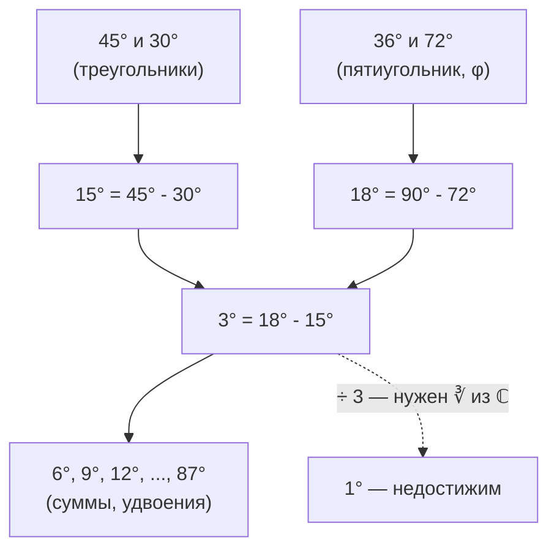

# Глава 3.1. Точные значения синусов и косинусов

## 3.1.1. Зачем считать руками?

Калькулятор мгновенно выдаст $\sin 37° \approx 0{,}6018...\,$. Но это приближение — бесконечная десятичная дробь. Для некоторых углов значение записывается **точно**, через корни. Какие именно углы это позволяют — и почему не все — вопрос, уходящий в самую глубину алгебры.

---

## 3.1.2. Углы 45° и 30°: из геометрии

### Угол 45°

Равнобедренный прямоугольный треугольник: катеты $1$, гипотенуза $\sqrt{2}$.

$$\sin 45° = \cos 45° = \frac{1}{\sqrt{2}} = \frac{\sqrt{2}}{2}$$

### Угол 30° и 60°

Половина равностороннего треугольника со стороной $2$: катеты $1$ и $\sqrt{3}$, гипотенуза $2$.

$$\sin 30° = \frac{1}{2}, \quad \cos 30° = \frac{\sqrt{3}}{2}$$

$$\sin 60° = \frac{\sqrt{3}}{2}, \quad \cos 60° = \frac{1}{2}$$

### Сводная таблица базовых углов

| Угол $\alpha$ | $\sin \alpha$ | $\cos \alpha$ | $\tan \alpha$ | Мнемоника $\sin$ |
|:---:|:---:|:---:|:---:|:---:|
| $0°$ | $0$ | $1$ | $0$ | $\frac{\sqrt{0}}{2}$ |
| $30°$ | $\frac{1}{2}$ | $\frac{\sqrt{3}}{2}$ | $\frac{1}{\sqrt{3}}$ | $\frac{\sqrt{1}}{2}$ |
| $45°$ | $\frac{\sqrt{2}}{2}$ | $\frac{\sqrt{2}}{2}$ | $1$ | $\frac{\sqrt{2}}{2}$ |
| $60°$ | $\frac{\sqrt{3}}{2}$ | $\frac{1}{2}$ | $\sqrt{3}$ | $\frac{\sqrt{3}}{2}$ |
| $90°$ | $1$ | $0$ | — | $\frac{\sqrt{4}}{2}$ |

!!! tip "Мнемоника"
    Синусы базовых углов — это $\frac{\sqrt{0}}{2}$, $\frac{\sqrt{1}}{2}$, $\frac{\sqrt{2}}{2}$, $\frac{\sqrt{3}}{2}$, $\frac{\sqrt{4}}{2}$. Под корнем: $0, 1, 2, 3, 4$. Косинусы — та же последовательность в обратном порядке.

Эти пять углов знает каждый. А дальше?

---

## 3.1.3. Формулы сложения — главный инструмент

Для вычисления синусов и косинусов новых углов нужны **формулы сложения**:

$$\sin(\alpha \pm \beta) = \sin\alpha\cos\beta \pm \cos\alpha\sin\beta$$

$$\cos(\alpha \pm \beta) = \cos\alpha\cos\beta \mp \sin\alpha\sin\beta$$

Из них как следствия:

**Формулы двойного угла:**

$$\sin 2\alpha = 2\sin\alpha\cos\alpha$$

$$\cos 2\alpha = \cos^2\alpha - \sin^2\alpha = 2\cos^2\alpha - 1 = 1 - 2\sin^2\alpha$$

**Формула половинного угла** (из $\cos 2\alpha = 1 - 2\sin^2\alpha$):

$$\sin\frac{\alpha}{2} = \sqrt{\frac{1 - \cos\alpha}{2}}, \qquad \cos\frac{\alpha}{2} = \sqrt{\frac{1 + \cos\alpha}{2}}$$

(знак корня — по четверти угла $\frac{\alpha}{2}$)

---

## 3.1.4. Угол 15°: первая комбинация

$$15° = 45° - 30°$$

$$\sin 15° = \sin(45° - 30°) = \sin 45°\cos 30° - \cos 45°\sin 30°$$

$$= \frac{\sqrt{2}}{2} \cdot \frac{\sqrt{3}}{2} - \frac{\sqrt{2}}{2} \cdot \frac{1}{2} = \frac{\sqrt{6} - \sqrt{2}}{4}$$

$$\cos 15° = \cos(45° - 30°) = \cos 45°\cos 30° + \sin 45°\sin 30°$$

$$= \frac{\sqrt{2}}{2} \cdot \frac{\sqrt{3}}{2} + \frac{\sqrt{2}}{2} \cdot \frac{1}{2} = \frac{\sqrt{6} + \sqrt{2}}{4}$$

Проверка: $\sin^2 15° + \cos^2 15° = \frac{6 - 2\sqrt{12} + 2 + 6 + 2\sqrt{12} + 2}{16} = \frac{16}{16} = 1$. ✓

Из 15° половинным углом получаем $7{,}5°$, а из суммы/разности — $75° = 90° - 15°$.

---

## 3.1.5. Пятиконечная звезда и угол 36°

Правильный пятиугольник и вписанная в него звезда — источник углов $36°$, $72°$, $108°$, $144°$. Ключ к ним — **золотое сечение**.

### Золотой треугольник

В правильном пятиугольнике диагональ делит угол $108°$ на $36°$ и $72°$. Возникает **равнобедренный треугольник** с углами $36°$–$72°$–$72°$ (золотой треугольник).

Пусть сторона пятиугольника равна $1$, а диагональ $d$. Из подобия треугольников:

$$\frac{d}{1} = \frac{1}{d - 1}$$

$$d^2 - d - 1 = 0 \quad \Rightarrow \quad d = \frac{1 + \sqrt{5}}{2} = \varphi$$

Это **золотое сечение** $\varphi \approx 1{,}618$.

### Вычисление $\cos 36°$

Рассмотрим равнобедренный треугольник с углом при вершине $36°$ и боковыми сторонами $1$. Основание — $2\sin 18°$. Но проще идти через формулу двойного угла.

Заметим: $36° = \frac{1}{2} \cdot 72°$, а $72° = \frac{360°}{5}$ — центральный угол правильного пятиугольника.

Используем тождество $\cos 36° - \cos 72° = \frac{1}{2}$ (оно следует из того, что $\cos 36°$ и $\cos 72°$ — корни определённого квадратного уравнения).

Пусть $c = \cos 36°$. Тогда $\cos 72° = 2c^2 - 1$ (формула двойного угла). Подставим:

$$c - (2c^2 - 1) = \frac{1}{2}$$

$$c - 2c^2 + 1 = \frac{1}{2}$$

$$4c^2 - 2c - 1 = 0$$

Это **квадратное** уравнение! По формуле:

$$c = \frac{2 + \sqrt{4 + 16}}{8} = \frac{2 + \sqrt{20}}{8} = \frac{1 + \sqrt{5}}{4}$$

(берём положительный корень, так как $\cos 36° > 0$)

$$\boxed{\cos 36° = \frac{1 + \sqrt{5}}{4} = \frac{\varphi}{2}}$$

Проверка: $\frac{1 + \sqrt{5}}{4} \approx \frac{1 + 2{,}236}{4} \approx 0{,}809$. Калькулятор: $\cos 36° \approx 0{,}809$. ✓

!!! tip "Связь с золотым сечением"
    $\cos 36° = \frac{\varphi}{2}$, где $\varphi = \frac{1+\sqrt{5}}{2}$ — золотое сечение. В правильном пятиугольнике отношение диагонали к стороне, отношение частей диагонали и косинус $36°$ — всё выражается через $\varphi$.

### Остальные «пятёрочные» углы

Из $\cos 36°$ получаем всё остальное:

$$\sin 36° = \sqrt{1 - \cos^2 36°} = \sqrt{1 - \frac{6 + 2\sqrt{5}}{16}} = \sqrt{\frac{10 - 2\sqrt{5}}{16}} = \frac{\sqrt{10 - 2\sqrt{5}}}{4}$$

$$\cos 72° = 2\cos^2 36° - 1 = 2 \cdot \frac{6 + 2\sqrt{5}}{16} - 1 = \frac{6 + 2\sqrt{5}}{8} - 1 = \frac{\sqrt{5} - 1}{4}$$

$$\sin 72° = \cos 18° = \frac{\sqrt{10 + 2\sqrt{5}}}{4}$$

### Угол 18°

$$\cos 18° = \sin 72° = \frac{\sqrt{10 + 2\sqrt{5}}}{4}$$

$$\sin 18° = \cos 72° = \frac{\sqrt{5} - 1}{4}$$

Заметим: $\sin 18° = \frac{\varphi - 1}{2} = \frac{1}{2\varphi}$. Ещё одна формула с золотым сечением!

### Расширенная таблица

| Угол | $\sin$ | $\cos$ |
|:---:|:---:|:---:|
| $18°$ | $\frac{\sqrt{5}-1}{4}$ | $\frac{\sqrt{10+2\sqrt{5}}}{4}$ |
| $36°$ | $\frac{\sqrt{10-2\sqrt{5}}}{4}$ | $\frac{1+\sqrt{5}}{4}$ |
| $54°$ | $\frac{1+\sqrt{5}}{4}$ | $\frac{\sqrt{10-2\sqrt{5}}}{4}$ |
| $72°$ | $\frac{\sqrt{10+2\sqrt{5}}}{4}$ | $\frac{\sqrt{5}-1}{4}$ |

---

## 3.1.6. Угол 3°: предел возможного

Мы знаем точные значения для $18°$ и $15°$. Их разность:

$$3° = 18° - 15°$$

Применяем формулу разности:

$$\sin 3° = \sin 18° \cos 15° - \cos 18° \sin 15°$$

$$= \frac{\sqrt{5}-1}{4} \cdot \frac{\sqrt{6}+\sqrt{2}}{4} - \frac{\sqrt{10+2\sqrt{5}}}{4} \cdot \frac{\sqrt{6}-\sqrt{2}}{4}$$

$$\boxed{\sin 3° = \frac{(\sqrt{5}-1)(\sqrt{6}+\sqrt{2}) - \sqrt{(10+2\sqrt{5})(6-2\sqrt{12}+2)}}{16}}$$

Выражение громоздкое, но **точное** и содержит только квадратные корни (вложенные — не страшно, это всё ещё радикалы).

Из $3°$ можно получить:

- $6° = 2 \times 3°$ — формула двойного угла
- $9° = 3 \times 3°$ — формула тройного угла
- $12° = 15° - 3°$ — формула разности
- $21° = 18° + 3°$ — формула суммы

и далее **любой угол, кратный 3°**: $3°, 6°, 9°, 12°, \ldots, 87°$.

!!! note "Почему именно кратные 3°?"
    Мы получили $3°$ как $\gcd(15°, 18°) = 3°$. Любой угол, кратный $3°$, выражается через сумму/разность/удвоение уже известных. А вот $1°$ или $2°$ из этого набора **не получаются** — для них потребовалась бы ступень «деление угла на 3».

---

## 3.1.7. Почему $\sin 1°$ нельзя вычислить (в обычных радикалах)

### Задача трисекции

Чтобы от $3°$ перейти к $1°$, нужно **разделить угол на три**. Задача: зная $\sin 3°$, найти $\sin 1°$.

Формула тройного угла:

$$\sin 3\alpha = 3\sin\alpha - 4\sin^3\alpha$$

Подставим $\alpha = 1°$, $\sin 3° = \sin 3°$ (известен). Пусть $t = \sin 1°$:

$$\sin 3° = 3t - 4t^3$$

$$4t^3 - 3t + \sin 3° = 0$$

Это **кубическое уравнение** относительно $t$!

### Casus irreducibilis снова

Вычислим дискриминант этого кубического уравнения. Оно уже депрессированное ($y^2$ отсутствует): $p = -\frac{3}{4}$, $q = \frac{\sin 3°}{4}$.

$$Q = \frac{q^2}{4} + \frac{p^3}{27} = \frac{\sin^2 3°}{64} + \frac{-27/64}{27} = \frac{\sin^2 3° - 1}{64} = \frac{-\cos^2 3°}{64} < 0$$

$Q < 0$ — это в точности **casus irreducibilis** из Главы 2.3! Кубическое уравнение имеет три вещественных корня (а именно $\sin 1°$, $\sin 59°$, $-\sin 61°$), но формула Кардано выражает их через **комплексные** кубические корни.

!!! warning "Ключевой результат"
    $\sin 1°$ нельзя выразить через $\sin 3°$ (или через рациональные числа и $\sqrt{\ }$) с помощью одних лишь арифметических операций и извлечения квадратных корней. Требуется кубический корень — причём из комплексного числа.

### Что это значит на практике

$\sin 1°$ **существует** как число и вычисляется с любой точностью:

$$\sin 1° \approx 0{,}01745240643...\,$$

Но **точная формула** в виде выражения с вложенными квадратными корнями (каким мы записали $\sin 3°$) — невозможна. Можно записать $\sin 1°$ через кубический корень из комплексного числа:

$$\sin 1° = \frac{1}{2i}\left(\sqrt[3]{\cos 3° + i\sin 3°} - \sqrt[3]{\cos 3° - i\sin 3°}\right)$$

но это уже **не** «формула в обычных радикалах».

---

## 3.1.8. Какие углы допускают точное вычисление?

Вопрос «для каких целых $n°$ значение $\sin n°$ выражается через квадратные радикалы?» связан с классической задачей **построения правильных многоугольников** циркулем и линейкой.

Угол $n°$ допускает точную формулу в квадратных радикалах тогда и только тогда, когда $\frac{360°}{n}$-угольник **построим** циркулем и линейкой. По теореме Гаусса — Вентцеля, правильный $m$-угольник построим тогда и только тогда, когда:

$$m = 2^k \cdot p_1 \cdot p_2 \cdots p_s$$

где $p_i$ — **различные простые числа Ферма** (простые вида $2^{2^n} + 1$):

$$3, \quad 5, \quad 17, \quad 257, \quad 65537, \quad \ldots$$

Это объясняет всё:

| Угол | Связан с $m$-угольником | Построим? | Почему |
|:---:|:---:|:---:|---|
| $60°$ | $m = 6 = 2 \cdot 3$ | Да | $3$ — число Ферма |
| $72°$ | $m = 5$ | Да | $5$ — число Ферма |
| $36°$ | $m = 10 = 2 \cdot 5$ | Да | |
| $15°$ | $m = 24 = 2^3 \cdot 3$ | Да | |
| $3°$ | $m = 120 = 2^3 \cdot 3 \cdot 5$ | Да | |
| $1°$ | $m = 360 = 2^3 \cdot 3^2 \cdot 5$ | **Нет** | **$3^2$** — тройка повторяется! |

Тройка $3$ входит в $360$ **дважды** ($3^2 = 9$), что нарушает условие «различные числа Ферма». Именно поэтому $1°$ не берётся.

!!! note "А если линейку и циркуль заменить на нейсис?"
    С помощью **нейсиса** (линейки с двумя отметками) можно проводить трисекцию угла — и тогда $\sin 1°$ выражается в «кубических радикалах». Но это уже выходит за рамки классических построений.

---

## 3.1.9. Итоговая «карта» вычислимых углов

Из базовых углов $30°$, $36°$, $45°$ и формул сложения/вычитания/удвоения/половины достижимы все углы, кратные $3°$:

$$\boxed{3°, \; 6°, \; 9°, \; 12°, \; 15°, \; 18°, \; 21°, \; \ldots, \; 87°, \; 90°}$$

Это 30 углов в первой четверти (и симметрично в остальных). Для всех них $\sin$ и $\cos$ записываются **точно** через квадратные корни.

### Цепочка вывода

---

!!! abstract "Резюме главы"
    - $\sin 45°$, $\sin 30°$, $\sin 60°$ — прямо из геометрии прямоугольных треугольников
    - $\cos 36° = \frac{1+\sqrt{5}}{4}$ — из правильного пятиугольника и золотого сечения
    - Формулы сложения позволяют комбинировать известные углы: $15° = 45° - 30°$, $3° = 18° - 15°$
    - Все углы, кратные $3°$, выражаются через вложенные квадратные корни
    - $\sin 1°$ **не** выражается в квадратных радикалах — трисекция $3°$ сводится к **кубическому уравнению** с $Q < 0$ (casus irreducibilis, Глава 2.3)
    - Вычислимость углов связана с **построимостью правильных многоугольников** (теорема Гаусса — Вентцеля) и **числами Ферма**

---

## Задачи

### Базовый уровень ⭐

**3.1.1.** Вычислите $\sin 75°$ и $\cos 75°$, используя $75° = 45° + 30°$.

??? note "Ответ"
    $\sin 75° = \cos 15° = \frac{\sqrt{6}+\sqrt{2}}{4}$, $\cos 75° = \sin 15° = \frac{\sqrt{6}-\sqrt{2}}{4}$.

**3.1.2.** Проверьте, что $\sin^2 18° + \cos^2 18° = 1$, подставив точные значения.

??? note "Ответ"
    $\sin^2 18° = \frac{6-2\sqrt{5}}{16}$, $\cos^2 18° = \frac{10+2\sqrt{5}}{16}$. Сумма $= \frac{16}{16} = 1$. ✓

**3.1.3.** Вычислите $\cos 54°$ двумя способами: (а) как $\sin 36°$; (б) из формулы $54° = 90° - 36°$.

??? note "Ответ"
    $\cos 54° = \sin 36° = \frac{\sqrt{10-2\sqrt{5}}}{4}$ — оба способа дают одно и то же.

### Средний уровень ⭐⭐

**3.1.4.** Найдите $\cos 36° - \cos 72°$ и объясните результат.

??? note "Ответ"
    $\cos 36° - \cos 72° = \frac{1+\sqrt{5}}{4} - \frac{\sqrt{5}-1}{4} = \frac{2}{4} = \frac{1}{2}$. Это следует из того, что $\cos 36°$ и $-\cos 72°$ — корни подходящего квадратного уравнения, и их разность связана с дискриминантом.

**3.1.5.** Выразите $\sin 9°$ через радикалы. (*Подсказка: $9° = \frac{18°}{2}$, используйте формулу половинного угла.*)

??? note "Ответ"
    $\sin 9° = \sqrt{\frac{1 - \cos 18°}{2}} = \sqrt{\frac{1 - \frac{\sqrt{10+2\sqrt{5}}}{4}}{2}} = \frac{1}{2}\sqrt{2 - \frac{\sqrt{10+2\sqrt{5}}}{2}}$.

**3.1.6.** Покажите, что $4\sin^3 1° - 3\sin 1° + \sin 3° = 0$. Объясните, почему это не помогает найти $\sin 1°$ в радикалах.

??? note "Ответ"
    Это формула тройного угла: $\sin 3° = 3\sin 1° - 4\sin^3 1°$. Уравнение $4t^3 - 3t + \sin 3° = 0$ — кубическое с $Q < 0$ (casus irreducibilis). Три корня вещественные, но формула Кардано содержит $\sqrt[3]{\text{комплексного числа}}$.

### Олимпиадный уровень ⭐⭐⭐

**3.1.7.** Докажите, что $\cos 20°$ является корнем уравнения $8t^3 - 6t - 1 = 0$, и покажите, что это уравнение попадает в casus irreducibilis. (*Подсказка: $3 \times 20° = 60°$.*)

??? note "Ответ"
    $\cos 60° = \frac{1}{2} = 4\cos^3 20° - 3\cos 20°$. Пусть $t = \cos 20°$: $4t^3 - 3t = \frac{1}{2}$, т.е. $8t^3 - 6t - 1 = 0$. Депрессия: $p = -\frac{3}{4}$, $q = -\frac{1}{8}$, $Q = \frac{1}{256} - \frac{1}{64} = -\frac{3}{256} < 0$.

**3.1.8.** Докажите тождество $\sin 18° \cdot \sin 54° = \frac{1}{4}$. (*Подсказка: выразите через $\varphi$.*)

??? note "Ответ"
    $\sin 18° = \frac{\sqrt{5}-1}{4}$, $\sin 54° = \cos 36° = \frac{1+\sqrt{5}}{4}$.
    Произведение: $\frac{(\sqrt{5}-1)(1+\sqrt{5})}{16} = \frac{(\sqrt{5}-1)(\sqrt{5}+1)}{16} = \frac{5-1}{16} = \frac{1}{4}$. ✓
